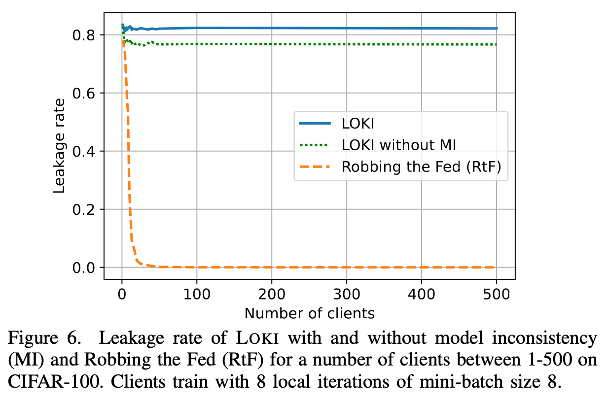

Below I will discuss <em>some<em> of the research problems I have worked on along with the core results (and the corresponding papers they come from). Please find a list of all my publications [here](https://joshuaczhao.github.io/publications/).

Federated (distributed) learning privacy (and security)
======
Data privacy is critically important, a point intricately tied to machine learning (ML). Models quite literally live and die by the data used to train them. However, this data must come from somewhere. With increasingly more data hungry models, data is obtained from the huge digital trail that we leave in our daily lives, a wide and ever increasing source of data. There is sometimes less care taken for whether the owners of the data agree to participate or are even aware of it. One potential way to circumvent this is through distributed learning or federated learning (FL). Here, willing participants can help in training models on their private data without sharing the data with others.

FL has been introduced for privacy in many applications, where a few examples are connected autonomous vehicles or Google Gboard. Here, a server sends the model to clients (e.g., mobile devices), and clients train locally on their private data. Only model updates are sent from the clients to the server which has a few advantages. First, ML models can learn from private client data without it leaving the client. This gives models access to not only more data, but more varied data, improving issues such as fairness which help prevent models from having biases towards certain things, such as gender or ethnicity. Second, there are tons of small devices. Server GPUs are powerful, but the collaborative computation of billions of smartphones or embedded devices can still allow for learning at a much larger scale.

While the potential of FL is great, there are still some fundamental challenges. For example, prior works have found that data can be leaked directly through machine learning gradients or updates \[1,2,3\] (data reconstruction attacks). However, many of these works have been limited in capability. For example, gradient inversion attacks have typically struggled with FedAvg (where clients train their model with multiple training iterations/epochs before sending their updates to the server). Data reconstruction attacks typically also struggle with scalability, so defenses such as secure aggregation (SA) invalidate them. One of our works, [LOKI: Large-scale Data Reconstruction Attack against Federated Learning through Model Manipulation](https://www.computer.org/csdl/proceedings-article/sp/2024/313000a030/1RjEa6sC0I8){:target="_blank"} **(S&P 2024)**, looks at addressing this scalability problem. We show that a malicious server can leak a majority of training images (76-86%) from hundreds of clients even when FedAvg and SA are used. In this setting, prior work could leak less than 1% of these images. This attack was made possible through a malicious server who can manipulate the model architecture/parameters. By adding customized convolutional kernels and fully connected layers to a model, the attacker can essentially recover the images verbatim. In the paper, we discuss many aspects of this attack, such as how the attacker can become more effective over training iterations or how the attack can actually leak more images in FedAvg than in FedSGD (where FedAvg is typically considered a more difficult setting to attack). You can check out the work [here](https://www.computer.org/csdl/proceedings-article/sp/2024/313000a030/1RjEa6sC0I8){:target="_blank"} for more details.

We also find an interesting resource problem coming with these powerful attacks. In the paper [The Resource Problem of Using Linear Layer Leakage Attack in Federated Learning](https://openaccess.thecvf.com/content/CVPR2023/papers/Zhao_The_Resource_Problem_of_Using_Linear_Layer_Leakage_Attack_in_CVPR_2023_paper.pdf){:target="_blank"} **(CVPR 2023)**, we discuss how these large-scale attacks can even add >5GB of size overhead to the model. We also discuss how these resource overheads can be decreased through sparsity, ultimately showing a decreasing the model size overhead by over 327x and the computation time by 3.34x. In another line of work, we explore how the quality and amount of leaked data can impact the performance of models in downstream tasks. In the paper [Leak and Learn: An Attacker’s Cookbook to Train Using Leaked Data from Federated Learning](https://openaccess.thecvf.com/content/CVPR2024/papers/Zhao_Leak_and_Learn_An_Attackers_Cookbook_to_Train_Using_Leaked_CVPR_2024_paper.pdf){:target="_blank"} **(CVPR 2024)**, we show the discrepancy of generalization accuracy between FL and standard centralized learning. We also show how leaked data can reach a near centralized performance on datasets such as CIFAR-10 even with less training images. We furter discuss the specific strengths and weaknesses of the two major categories of attacks, gradient inversion and linear layer leakage, when used for these downstream tasks.

The above summary discussed some of my works in federated (distributed) learning privacy. If you are interested in how we designed a robust-aggregation method for FL to gain byzantime robustness when there are up to 45% malicious participating clients, check out the paper [here](https://dl.acm.org/doi/pdf/10.1145/3579856.3582836){:target="_blank"}. If you are interested in a more general discussion of communication costs and privacy implications of different distributed learning paradigms (such as FL or P2PL), check out this work [here](https://ieeexplore.ieee.org/stamp/stamp.jsp?tp=&arnumber=10206535&tag=1){:target="_blank"}.

Adversarial machine learning
====== 
(To be added)